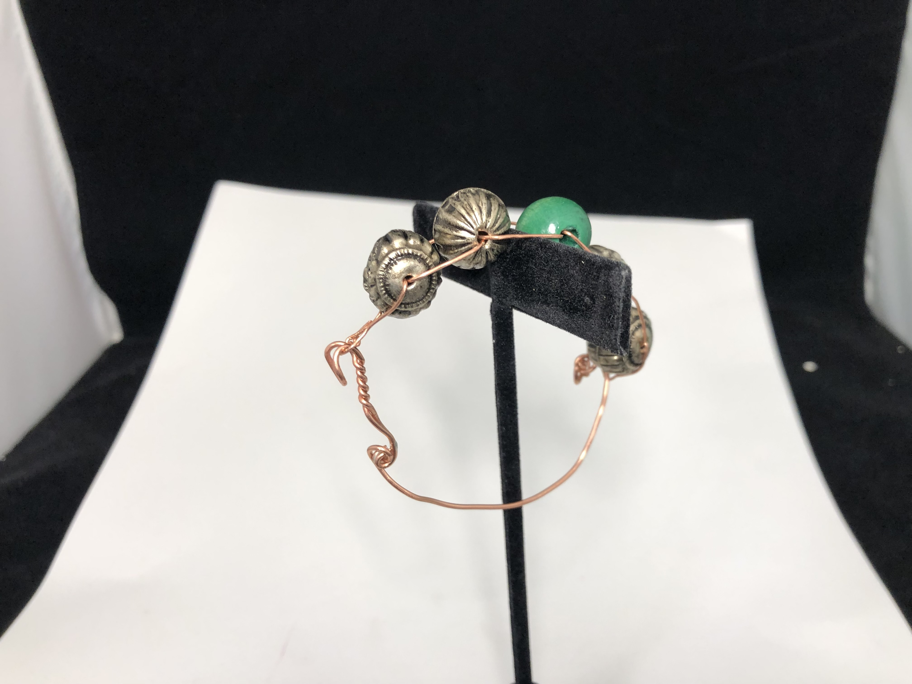
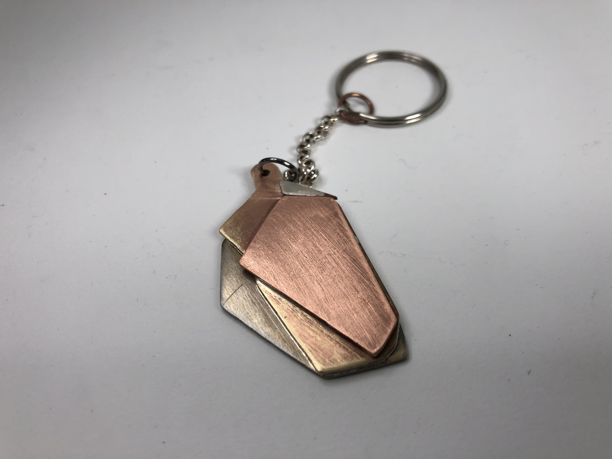
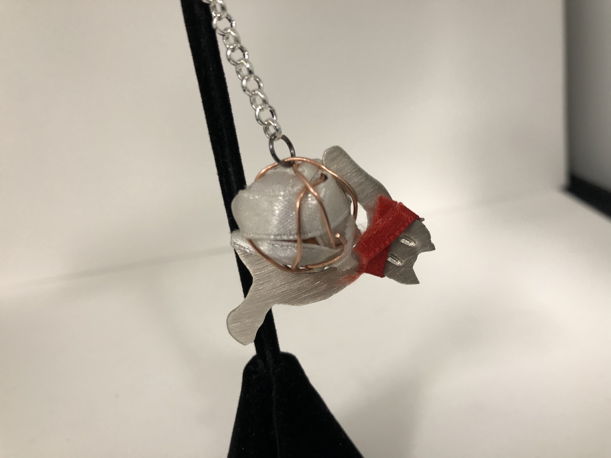

## Aluminum Project

For this project, I had difficulty deciding on what I wanted to make. I found that multiple of my ideas were too difficult to implement, and as such I discarded said ideas.

[Aluminum Project](Aluminum%20Project.md)

## Wire Project

I started this project late as I still finishing my aluminum project. Even so, I think these came out good.

[[Wire Project]]

My first idea. 2 22 gauge copper wires were threaded through each bead. Then, a latch was created, which was attached to the other side.

A simple ring. Made from 3 22 gauge wires twisted using a drill. The ends were soldered together at the end.

A keychain made from the leftover wire from the ring. The decoration at the bottom was from the scrap bin. The decoration was threaded onto one of the wires, which was then tied. The top was soldered to itself, then attached to a key ring.

## Riveting Project

it took a while to find what I wanted to create. My idea was 2 gears that could rotate around each other, however many things went wrong. My sawing was poor, and They didn't rotate at all.

[Riveting Project](Riveting%20Project.md)

## Sweat Soldering Project

Overall, this project was one of the easier ones. The sawing was easy (though I managed to mess it up for the gold layer), and it came together well. (reference: [https://obsidian.md](https://obsidian.md/))

[Sweat Soldering Project](Sweat%20Soldering%20Project.md)

## Combo Project

This was my favorite idea, a cat curled around a ball of "yarn". The most difficult part was getting it to wrap around the ball. The read ribbon is meant to be a collar, but it serves a dual purpose of hiding the mess up mouth stamp.

[Combo Project](Combo%20Project.md)