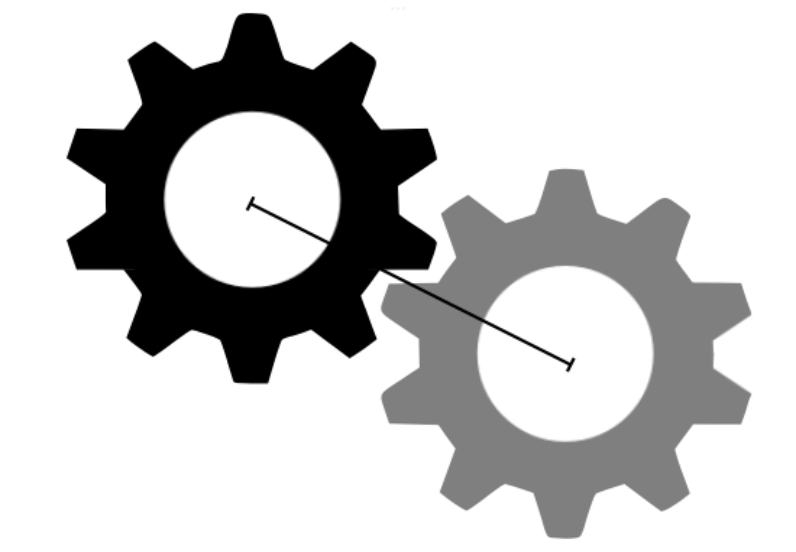
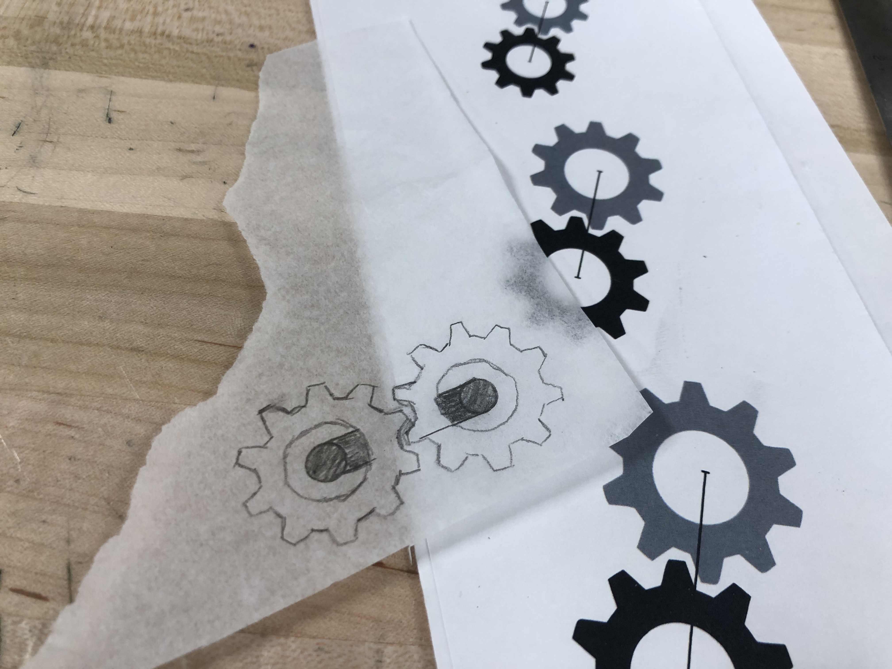
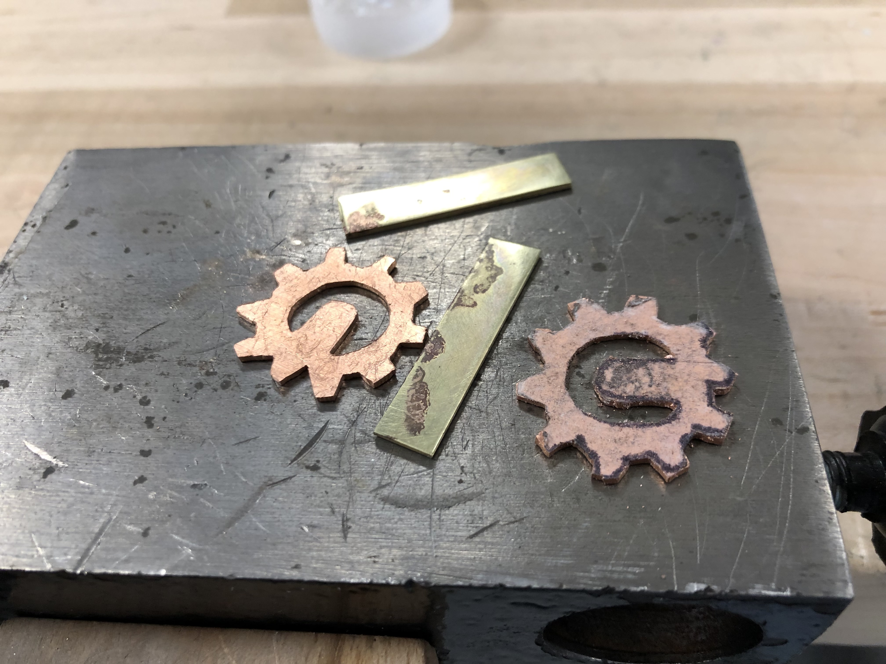
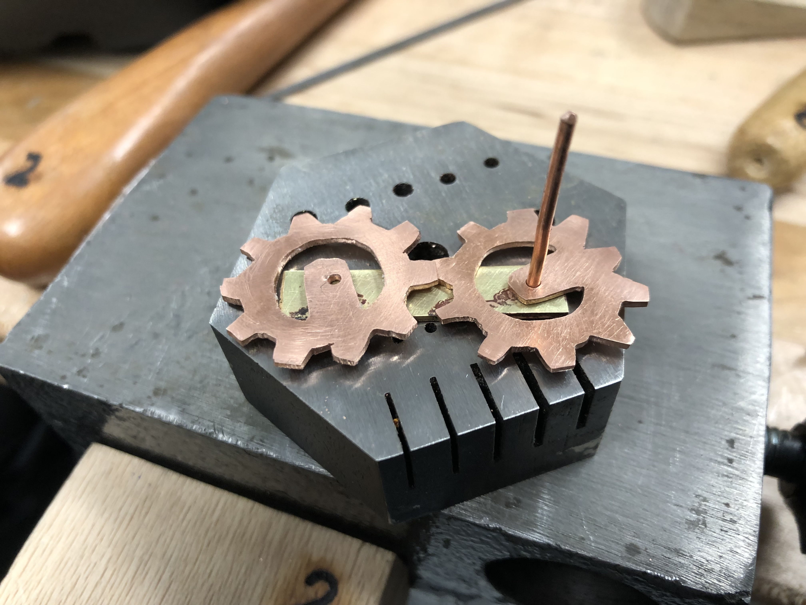
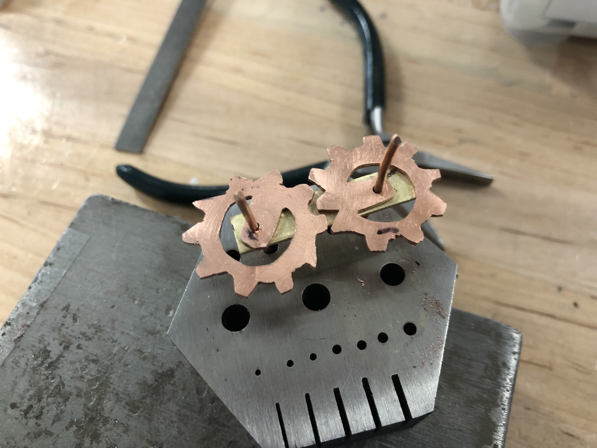
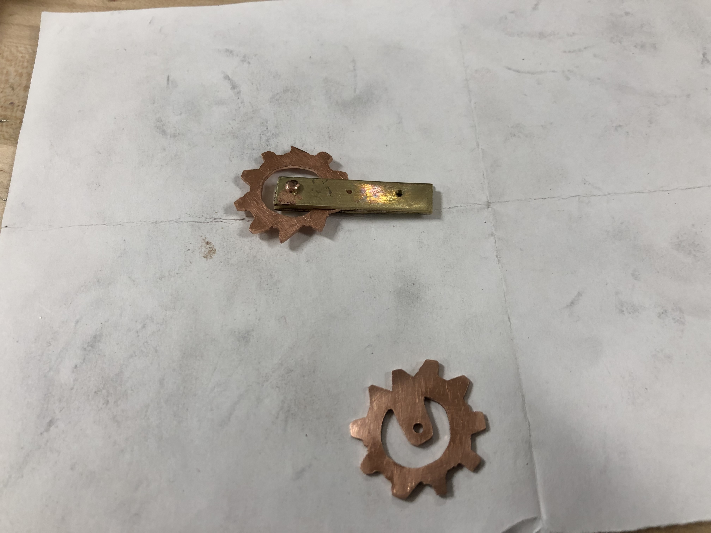
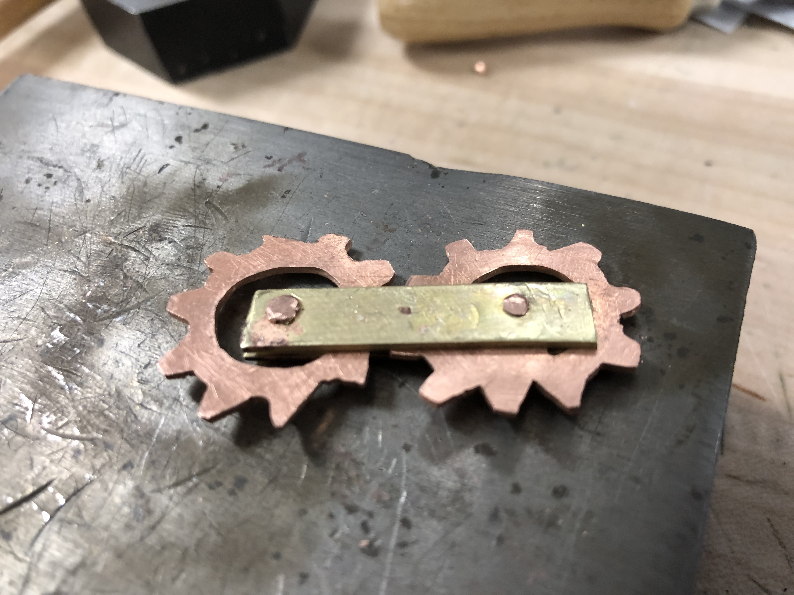

## Artist Statement

I was very low on ideas for this one. I saw the wires and though t that they could be used as an axel. Maybe I should have realized that it was a bad ideas sooner.

## Log

The design I chose.                                                         

Traced

        

Fully cut out

             

Holes drilled. I messed up one of the holes on the gears when the drill slipped. it was therefore unable to rotate around it's center.

     

I spent a long time trying to get the gears to fully rotate.    

             

First rivet in

      

Final product

      
