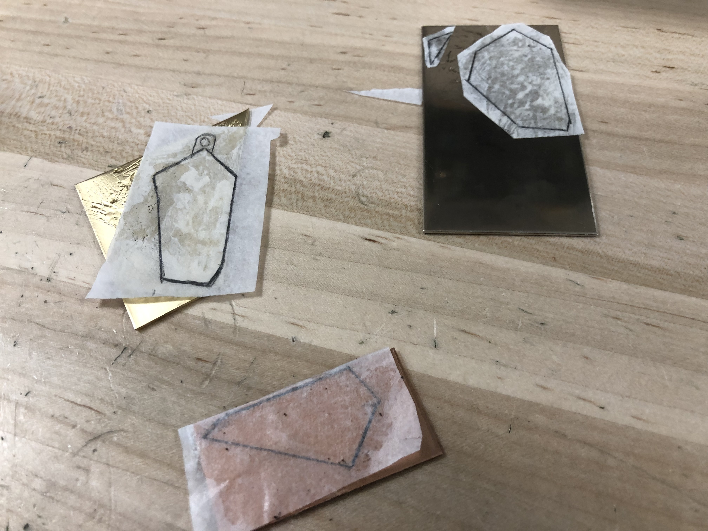
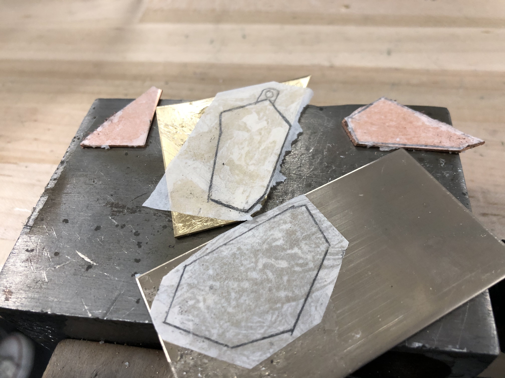
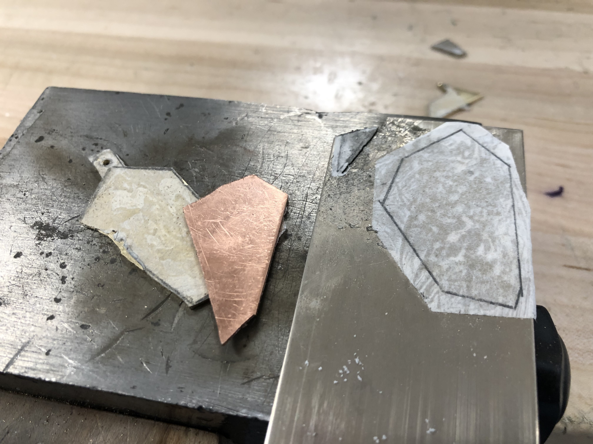
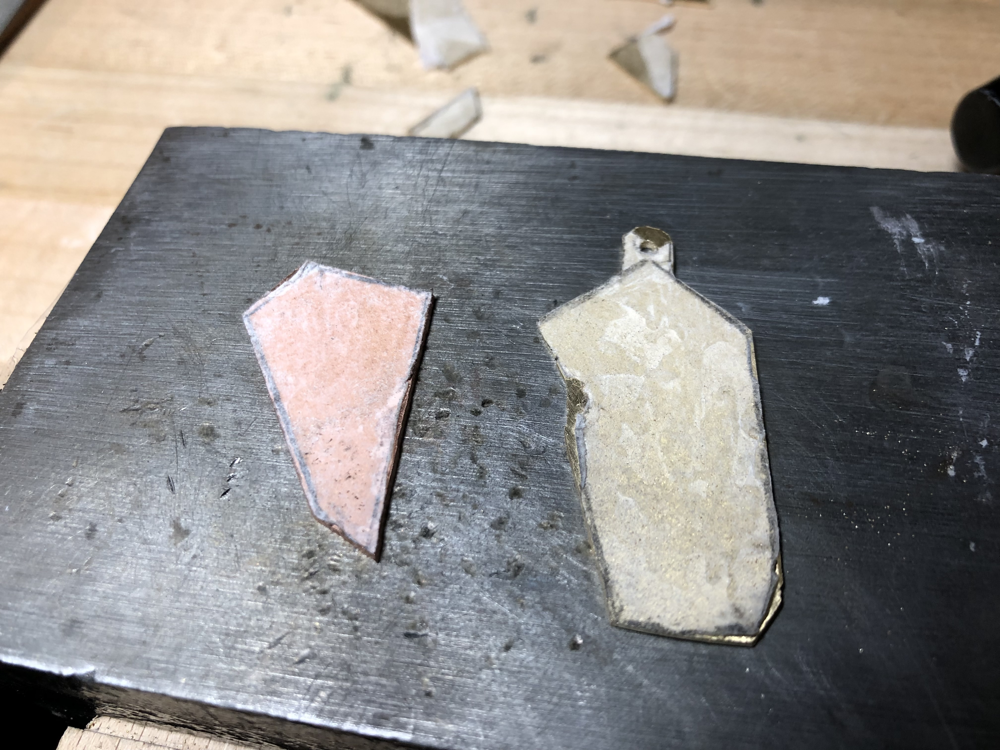
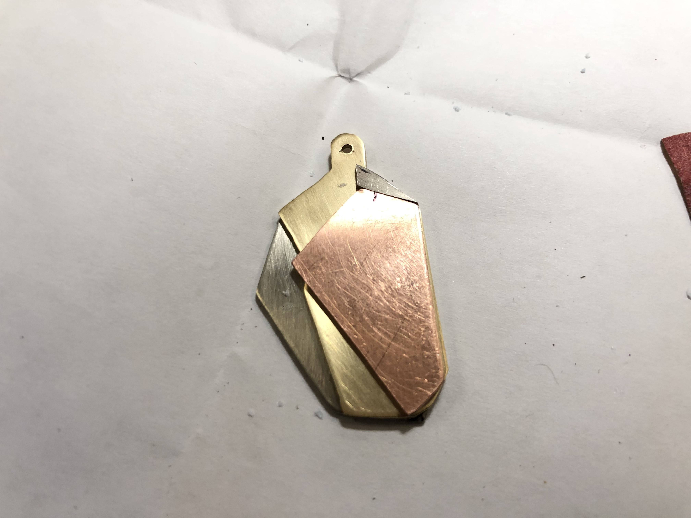
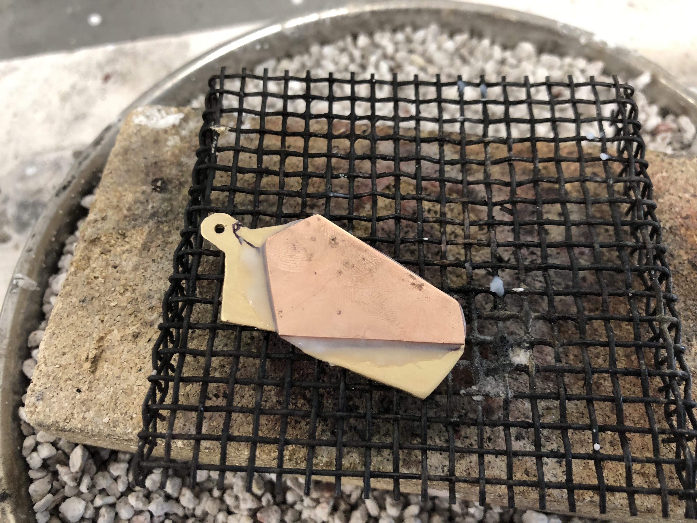
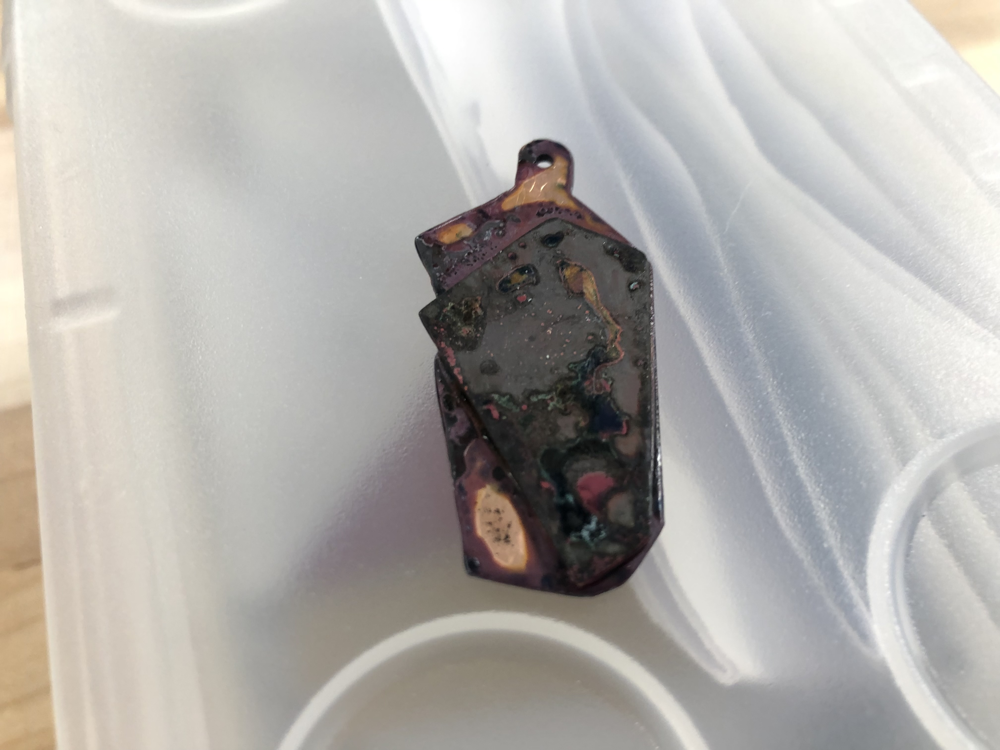

## Inspirations

I like their software, and their logo was very simple, conducive to sweat soldering.

## Artist Statement

I

## Log

Sketches glued to metals

Sawing completed

  

Pieces are soldered together.

  